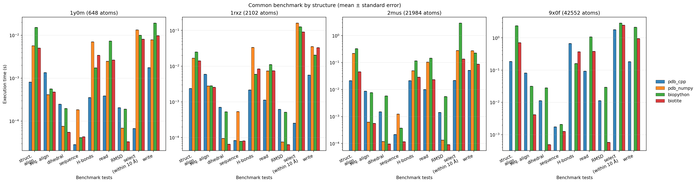

# pdb_cpp

Library to use pdb/mmcif files with c++.


## Installation

```bash
git clone https://github.com/samuelmurail/pdb_cpp
cd pdb_cpp
python -m pip install -e .
```

For development checks:

```bash
python -m pip install -r requirements.txt
pytest
```

## Usage
```python
import pdb_cpp

pdb_cpp.read_pdb("1aon.pdb")
```

## Benchmark: DockQ vs pdb_cpp

Run the benchmark and generate a Markdown table:

```bash
PYTHONPATH=src python benchmark/compare_dockq_speed.py --runs 3 --warmup 1 --mode end-to-end
python benchmark/csv_to_markdown.py --input benchmark/dockq_vs_pdb_cpp.csv --output benchmark/dockq_vs_pdb_cpp.md
```

Current results:

| Pair | DockQ mean (s) | DockQ median (s) | pdb_cpp mean (s) | pdb_cpp median (s) | Speedup (DockQ/pdb_cpp) | Runs | Warmup | Mode |
| --- | --- | --- | --- | --- | --- | --- | --- | --- |
| 1rxz_colabfold_vs_1rxz | 0.244837 | 0.240927 | 0.024377 | 0.023582 | 10.04x | 3 | 1 | end-to-end |
| model_vs_native | 0.336696 | 0.340798 | 0.112401 | 0.111557 | 3.00x | 3 | 1 | end-to-end |
| 1jd4_vs_5m6n | 0.251178 | 0.243843 | 0.017234 | 0.016501 | 14.57x | 3 | 1 | end-to-end |

## Benchmark: IO read/write speed

Run the IO benchmark and create the histogram figure:

```bash
PYTHONPATH=src python benchmark/compare_io_speed.py --runs 3 --warmup 1
python benchmark/plot_io_histogram.py --input benchmark/io_speed_comparison.csv --output benchmark/io_speed_histogram.png
```

Current histogram:


## Benchmark: common operations across 4 packages

Compare common operations (`read`, `write`, `select_within10_chainA`, `get_aa_seq`, `rmsd_ca_shift`, `dihedral_ca`, `align_seq_chainA`, `align_ca_self`) across `pdb_cpp`, `pdb_numpy`, `biopython`, and `biotite`.

`select_within10_chainA` uses a spatial query equivalent to: `within 10.0 of chain A`.
`align_seq_chainA` performs sequence-based alignment on chain A before coordinate superposition.

```bash
PYTHONPATH=src python benchmark/compare_common_speed.py --runs 3 --warmup 1 --files tests/input/1y0m.pdb tests/input/1rxz.pdb tests/input/2mus.pdb
python benchmark/plot_io_histogram.py --input benchmark/common_speed_comparison.csv --output benchmark/common_speed_histogram.png
```

The script prints, for each file/operation, `speedup_vs_pdb_cpp` and `pdb_cpp_superior` (`YES`/`NO`) and writes a CSV report to:

- `benchmark/common_speed_comparison.csv`

Grouped chart (x axis: tests, color: library, y axis: mean time with standard error on logarithmic scale; panel titles include PDB IDs and small/medium/big labels):




## Adding c++ code

To add c++ code, create new files in `src/pdb_cpp/_core` and then modify `setup.py` to include them in the build process.

```
ext_modules = [
    Pybind11Extension(
        "core",
        [
            "src/pdb_cpp/_core/pybind.cpp",
            "src/pdb_cpp/_core/sequence_align.cpp",  # Include sequence_align.cpp
            "src/pdb_cpp/_core/Model.cpp",
            "src/pdb_cpp/_core/Coor.cpp",
            # Add other source files as needed
        ],
        include_dirs=["src/pdb_cpp/_core"],  # Include directory for headers
        cxx_std=17,  # Use C++17 standard
    ),
]
```

Also add the function and class declarations in the `src/pdb_cpp/_core/pybind.cpp` file to expose your new functionality to Python.


## TODO list

- Add tests for usalign comparison.
- Add dockq score calculation.
- Add more documentation and examples.